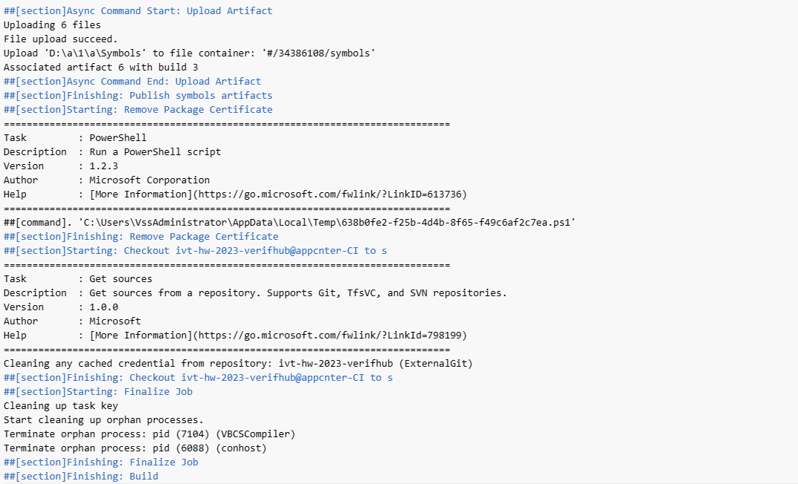
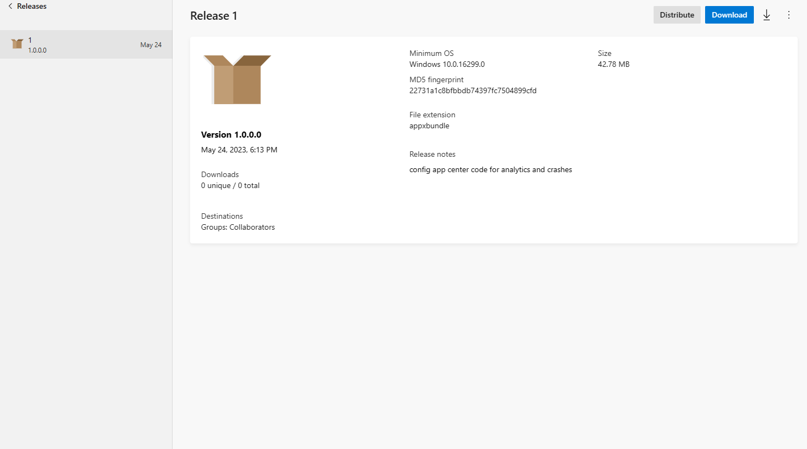

#Introduction
##App center: a tool for developer to build, test, and analysis your project.
### As our project is a UWP application, we will use this tool for CI and deploy, compared to github action, this tool has better adaptability for uwp applications.

---
##CI
###The following screen shots shows the CI build and test successfully. These screen shots include:
###Configuration and Environment: The log contains configuration and environment information such as operating system, Agent version, Runner Image version, and the tools used.
###Task execution: The log lists the different tasks performed, such as initializing the job, preparing the build directory, downloading the task, setting the build variables, checking the job parameters, etc.
.PNG)
###Source code fetching: The log shows the steps to fetch the source code from the code base, including clearing the cache credentials and checking out the code, etc.
###Build process: The log contains the tasks and operations during the build process, such as adding build target files, building UWP solutions, publishing build artifacts, etc.
.PNG)
.PNG)
###Asynchronous commands: The log shows the start and end of asynchronous commands, such as detecting Docker containers, uploading build artifacts, etc.
.PNG)
.PNG)
###Cleanup and wrap-up: The log contains cleanup and wrap-up operations after a task completes, such as cleaning up task keys, terminating isolated processes, etc.

---
##Deploy
###we release the application, it is app package, and we also deploy it on our own laptop.
