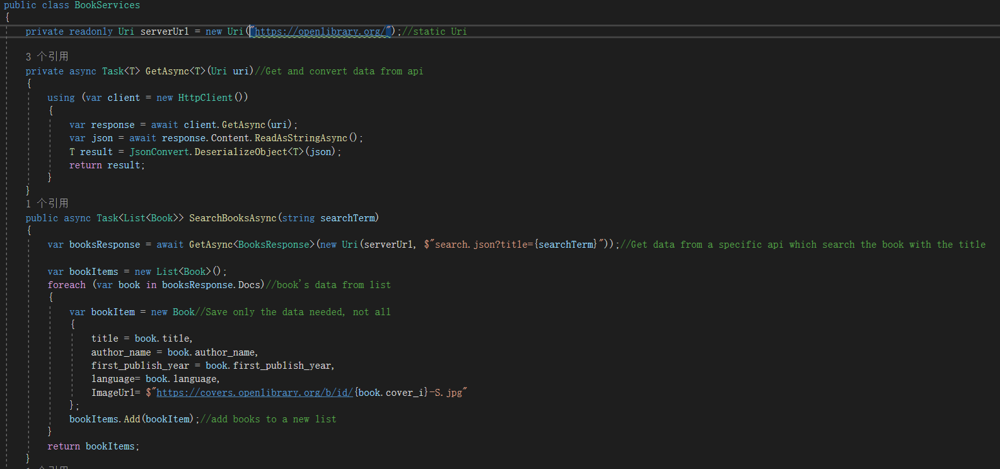
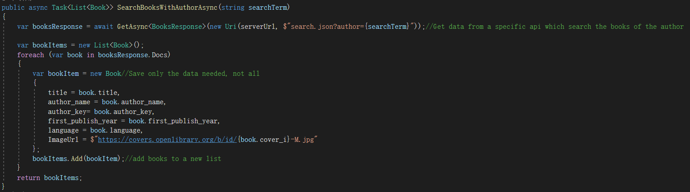

#Manual Code Review
Using the debug class from the .NET framework. Check the output tab of VS to compare manually
##Tasks to be reviewed.

---
###1. Number of books return from Api
In this test, we only required the number of books in the BookService method is equal to the number of books in the viewmodel, as the Api is limiting the number of result you can retrieval from remote.

Covering methods:

Result:

---
###2. AuthorKey transfer
In this test, we are checking whether data transfer between different pages is working properly.

Covering methods:
.PNG)

.PNG)

Result:

---
###3. data binding for searchterm
In this test, we are checking a critical point, the data binding, it is a communication between the client and viewmodel, at here we set the binding to two way mode.

Covering method:

.PNG)

Result:
.PNG)
.PNG)
