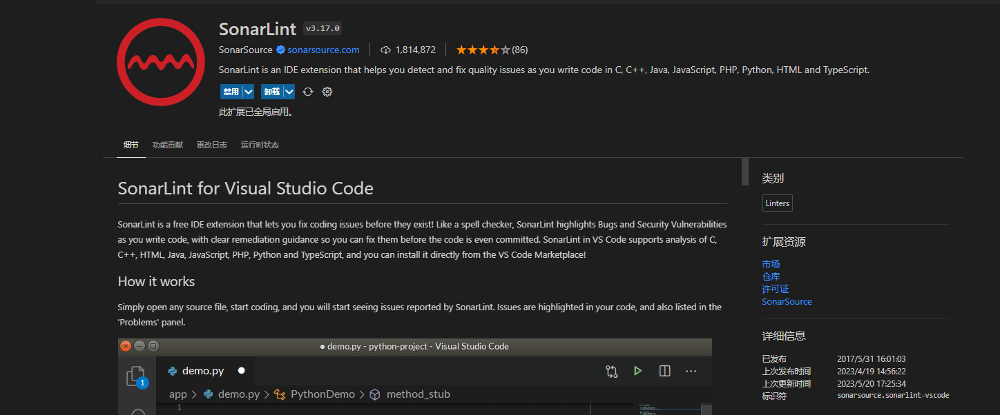

#Introduction
###Static analysis, also called static code analysis, is a method of computer program debugging that is done by examining the code without executing the program.

---
##First tool: Sonarlint in VS code

###Result: Whole project no issues found.

---
##Second tool: SonarAnalyzer.CSharp Nuget Package in Visual studio 2022.

###Result: Six warnings as follow:

