#Test introduction
## A unit test is way to test a unit in a program, unit means a function, a method and a property.
As our project is a UWP application, we are going to use UWP unit test, which is contained in the .NET framework.
Visual Studio offers UWP unit test project templates for C#
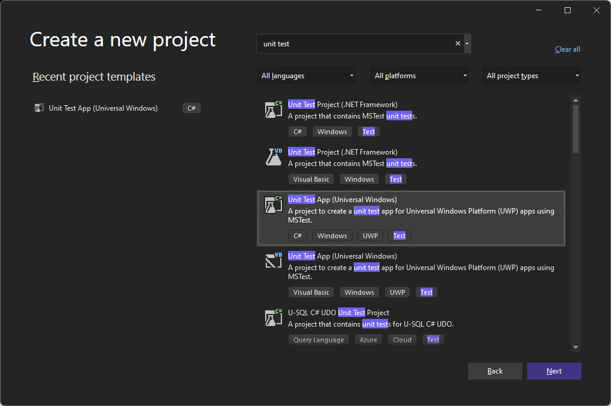

#Test
All Object intances we need before we can start unit tests.
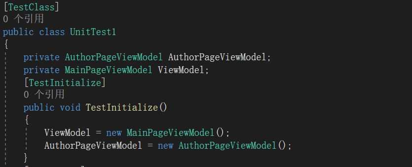
##Test #1: Searching books based on the title of the book
This test will check the returned data from remote api if it is null or not.This test will cover the associated ViewModel class, BookService class, and associated Model class.
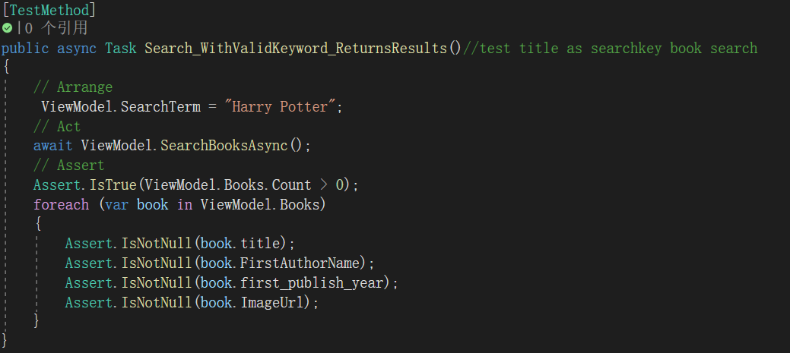

### Covered methods of the test #1

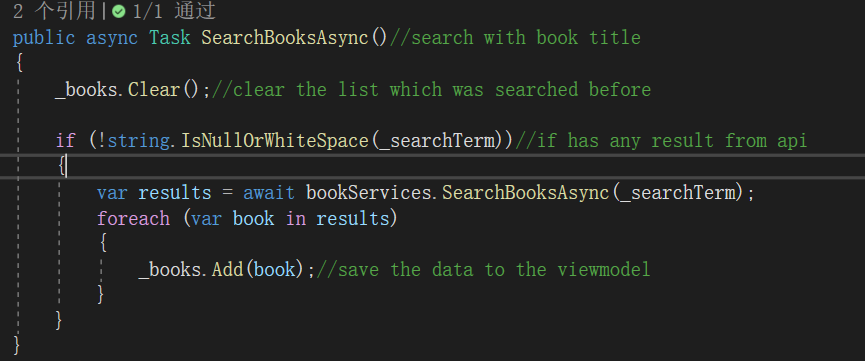

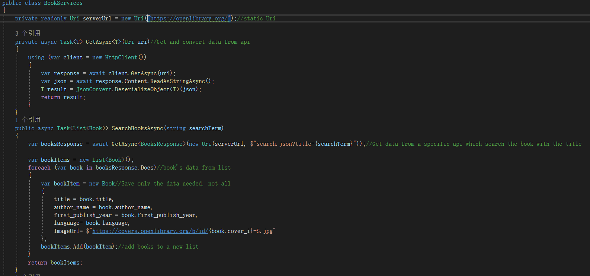

---
##Test #2: Searching books based on the author name of the book
This test will check the returned data from remote api if it is null or not, but this one is based on book's author.This test will cover the associated ViewModel class, BookService class, and associated Model class.
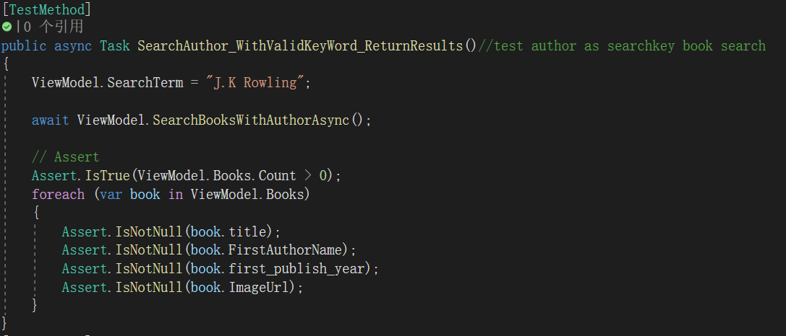

### Covered methods of the test #2

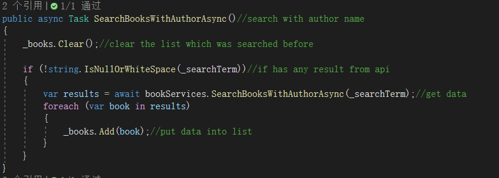

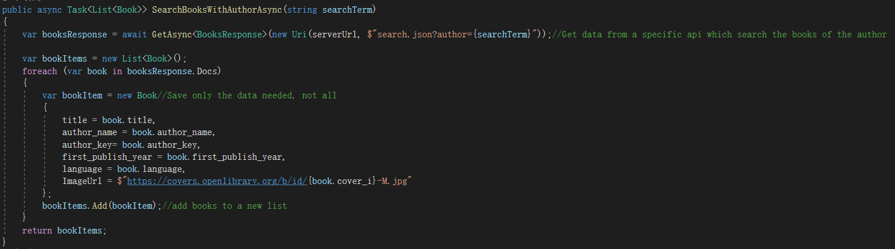

---
##Test #3： Searching author's detail based on the author key
This test will check the author's data retrieval from remote api is null or not.This test will cover the associated ViewModel class, BookService class, and associated Model class.
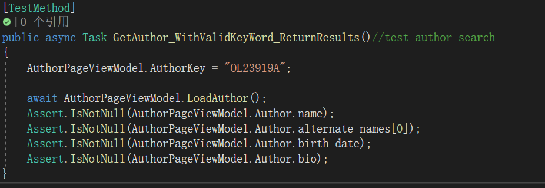

### Covered methods of the test #3

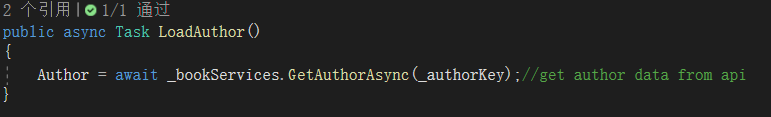

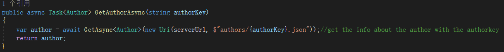

---
#Test Result
All three tests are successful.
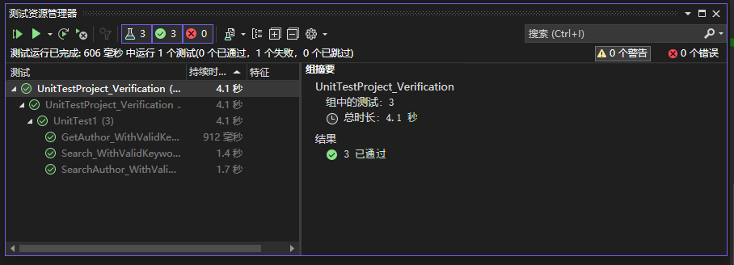

